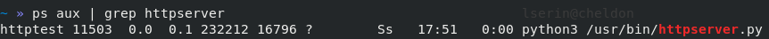
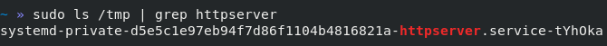

# Evaluation pour le module Sécurité des Infrastructures Virtualisées
***Pierre-Louis Palant / Landry Serin***

---

## Question 1:

Préparons l'environnement pour l'execution du service:

```bash
#Création de l'utilisateur qui executera le service
useradd httptest
#Le script appartient au nouvel utilisateur créé
chown httptest httpserver.py 
#Le script est maintenant executable
chmod u+x httpserver.py
#Copie du script dans /usr/bin
sudo cp httpserver.py /usr/bin
```

Il faut placer httpserver.service dans /etc/systemd/system/

Pour lancer le service on execute les commandes suivante:

```bash
sudo systemctl daemon-reload
sudo systemctl start httpserver.service
```

## Question 2:

Le service est executé avec l'utilisateur httptest qui n'as pas de bash ni de privilèges



Le service à bien son propre dossier privé dans /tmp:



## Question 3:

# A toi de jouer PL

## Question 4: 

Pour créer ce conteneur j'ai créer un dockerfile que vous pouvez trouver en pièce jointe
Ce dockerfile permet de respecter ces contraintes:
    - Image de fédora à jour
    - Variable d'environnement
    - Utilisateur non privilégié

Pour que le système soit en lecture seule et que l'on crée un point de montage il faudra le préciser dans la commande.

## Question 5: 

On construit ensuite l'image avec la commande: 

```bash
docker build -t imagehttp .
```

Puis on l'execute avec la commande suivante:

```bash
docker run --read-only -v volhttp:/tmp -d --name httpserver -p 8080:8080 imagehttp
```
Il faudra d'abord créer un volume

Afin de simplifier les choses j'ai utilisé docker-compose, il suffit ainsi d'executer: 

```bash
sudo docker-compose up -d  
```

Et docker-compose créer les volumes les montes et lance le conteneur


